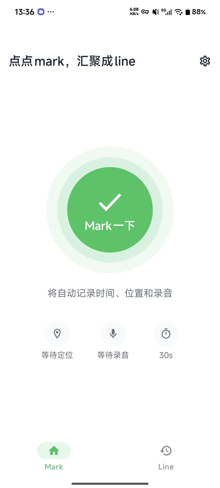
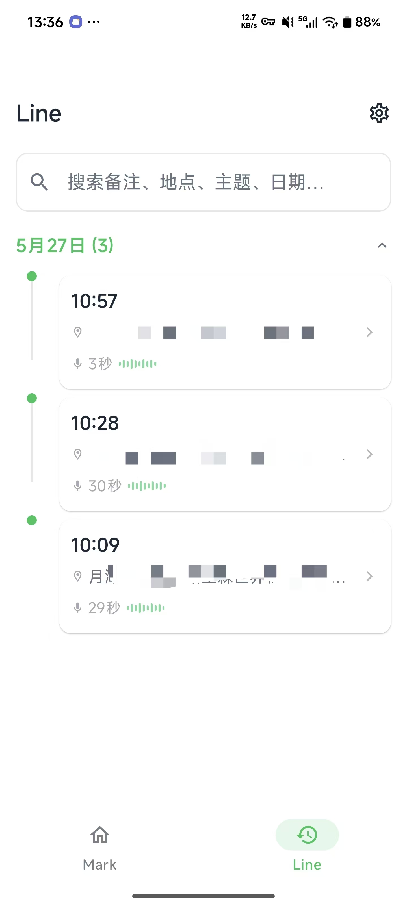
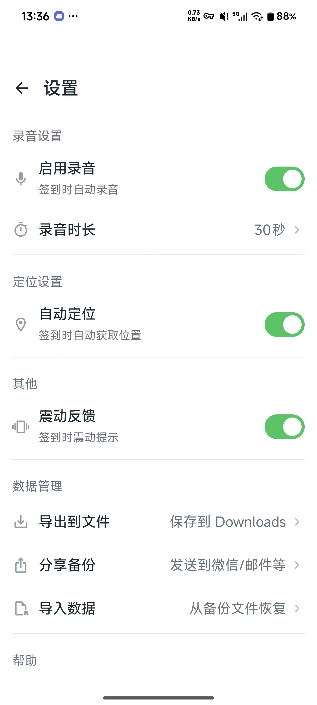

# MarkLine

> 点点mark，汇聚成line — 超低摩擦的现场事件记录工具

[](https://kotlinlang.org)
[](https://developer.android.com/compose)
[](https://developer.android.com)
[](LICENSE)

MarkLine 是一个极简的 Android 签到应用。一键记录时间、位置、录音，专注于**现场记录的超低摩擦体验**。

---

## 功能

| 模块 | 说明 |
|------|------|
| 🔴 **一键签到** | 点击即记录，<200ms 响应，Toast + 震动即时反馈 |
| 📍 **精确定位** | FusedLocation + 逆地理编码，支持门牌号解析，WGS-84 → GCJ-02 自动纠偏 |
| 🎙️ **现场录音** | 前台服务录制，M4A/AAC 格式，支持补录 |
| 📋 **时间轴** | 按天分组，7 天内展开 / 旧记录折叠，支持全文搜索 |
| 🏷️ **主题标签** | 自定义 label 对签到分类，快速筛选同类事件 |
| 🧩 **桌面小组件** | 1×1 快捷签到、2×2 大按钮签到 |
| 💾 **数据备份** | ZIP 打包导出（JSON + 音频文件），一键导入合并，UUID 去重 |
| 🌙 **深色模式** | 完整适配 Material3 深色主题 |
| 🔔 **通知提醒** | 签到完成后推送通知，点击直达详情 |

---

## 使用技巧

### 🎙️ 曲线救国：录音转文字到备注

**适用场景：** 点击 Mark 签到后，手头正忙（开车、搬运、手持工具等），不方便即时录入文字。此时可先通过录音做临时记录，等有空时再将录音转为文字写入备注，既完整保留了现场信息，又便于日后检索。

MarkLine 暂未内置语音识别，但可利用系统输入法的麦克风功能实现"录音→文字"效果：

1. 在事件详情页点击**备注编辑框**，唤起输入法
2. 点击输入法键盘上的**麦克风图标**，进入语音输入模式
3. 在 MarkLine 内点击录音文件的**播放按钮**，开始播放录音
4. 输入法会"听到"播放的音频，自动将其转为文字
5. 语音输入完成后，文字即进入备注字段，可手动微调后保存

> 💡 此方案依赖输入法的语音识别能力，识别质量因输入法而异，推荐使用豆包等最新的AI语音输入法。建议在安静环境下播放，并提高手机音量以获得更佳效果。

---

## 截图

<p align="center">
  
  &nbsp;&nbsp;
  
  &nbsp;&nbsp;
  
</p>

---

## 快速开始

### 环境要求

- Android Studio Hedgehog (2023.1) 或更高
- JDK 17+
- Android 10+ (API 29) 设备或模拟器

### 构建

```bash
# 克隆仓库
git clone https://github.com/kongzong/markline.git
cd markline

# 构建 Debug APK
./gradlew assembleDebug

# APK 输出路径
# app/build/outputs/apk/debug/app-debug.apk
```

### 安装

```bash
# 通过 ADB 安装
adb install app/build/outputs/apk/debug/app-debug.apk
```

---

## 项目结构

```
app/src/main/kotlin/app/markline/
├── MainActivity.kt                  # 入口，导航（首页/时间轴/设置图标）
├── MarkLineApp.kt                   # Application 单例，手动依赖管理
├── domain/
│   ├── Event.kt                     # 核心数据模型（uuid/label/status）
│   ├── EventStore.kt                # 存储接口
│   └── CheckinService.kt            # 签到核心逻辑
├── storage/
│   ├── DBHelper.kt                  # SQLiteOpenHelper，WAL 模式，v4 迁移
│   └── SQLiteEventStore.kt          # EventStore 实现
├── system/
│   ├── LocationService.kt           # FusedLocation（高精度 + GCJ-02 纠偏）
│   ├── AudioRecordService.kt        # 前台录音服务（Foreground Service）
│   ├── CheckinWidgetProvider.kt     # 1×1 签到小组件
│   ├── CheckinWidget2x2Provider.kt  # 2×2 签到小组件
│   └── WidgetCheckinReceiver.kt     # 小组件点击处理
├── ui/
│   ├── MainScreen.kt                # 超大签到按钮 + 实时状态
│   ├── TimelineScreen.kt            # 时间轴 + 搜索 + 标签过滤
│   ├── EventDetailScreen.kt         # 详情页（查看/编辑/补录）
│   ├── EditEventScreen.kt           # 编辑页（补定位/补录音）
│   ├── SettingsScreen.kt            # 设置（备份/帮助/关于/调试）
│   └── theme/
│       ├── Theme.kt                 # Material3 亮/暗主题
│       └── Typography.kt            # 字体排版
└── util/
    ├── AudioFileUtil.kt             # 音频文件路径工具
    ├── BackupData.kt                # 备份数据结构（v2 ZIP）
    ├── BackupManager.kt             # 导入导出引擎（ZIP + JSON 兼容）
    ├── CheckinNotifier.kt           # 签到通知管理
    ├── SettingsStore.kt             # DataStore 设置持久化
    ├── TimeUtil.kt                  # 时间格式化工具
    └── Wgs84ToGcj02.kt              # 坐标纠偏算法
```

---

## 技术栈

| 功能 | 技术选型 |
|------|----------|
| 语言 | Kotlin 2.0 |
| UI | Jetpack Compose + Material3 |
| 存储 | SQLite 原生（WAL 模式，手动迁移） |
| 异步 | Kotlin Coroutines |
| 设置 | DataStore Preferences |
| 定位 | FusedLocationProvider（高精度） |
| 录音 | MediaRecorder → Foreground Service |
| 序列化 | Gson |
| 备份 | ZIP（java.util.zip） |
| 构建优化 | R8 代码收缩 |

---

## 设计原则

- **即时响应**：签到操作 < 200ms 完成，定位/录音异步后台执行，失败不影响记录
- **极薄架构**：无 Room / DI 框架，直接 SQLiteOpenHelper，代码即文档
- **渐进增强**：先记录时间戳，再逐步补充位置、录音、备注
- **数据自有**：ZIP 格式完整导出，JSON 可读，音频独立文件，不被锁定在应用内

---

## 权限

| 权限 | 用途 | 触发时机 |
|------|------|----------|
| `VIBRATE` | 签到震动反馈 | 安装时自动授予 |
| `ACCESS_FINE_LOCATION` | GPS 精确定位 | 首次签到弹窗 |
| `ACCESS_COARSE_LOCATION` | 网络定位辅助 | 首次签到弹窗 |
| `RECORD_AUDIO` | 现场录音 | 首次签到弹窗 |
| `FOREGROUND_SERVICE` | 前台录音服务 | 录音时自动启用 |
| `POST_NOTIFICATIONS` | 签到通知 | 首次签到时弹窗 |

---

## 数据库

当前版本：**v4**

| 版本 | 变更 |
|------|------|
| v1 | 初始表结构 |
| v2 | 列重命名 `audio_path` → `audio_file_name` |
| v3 | 新增 `label` 列 |
| v4 | 新增 `uuid` 列 + 索引，支持跨设备合并 |

---

## 开发者

- **Kong** — 产品 & 开发
- **WorkBuddy** — AI 协作开发

---

## 许可证

MIT License
